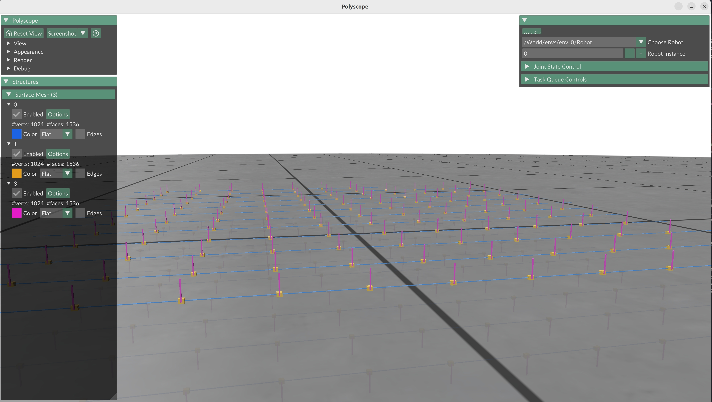

===========
U2U: USD to UIPC Physics Simulation
===========

**U2U** is a Python library that bridges Universal Scene Description (USD) and libuipc (physics simulation engine) to simplify physics-based robotics simulation. It provides a comprehensive pipeline for importing USD scenes, configuring physics properties, controlling robots through a task-based system, and exporting animations back to USD.

Key Features
============

- **USD Integration**: Import and export USD scenes with physics properties
- **Physics Simulation**: Configure and run physics simulations using libuipc with CUDA acceleration
- **Robot Control**: Task-based system for robot manipulation and control
- **Articulation Support**: Handle articulated robots with joint control and multiple control modes
- **Contact Modeling**: Configure contact properties and friction between objects
- **Visualization**: Real-time 3D visualization with Polyscope and interactive GUI
- **Pose Utilities**: Robust 3D pose representation and transformation utilities
- **Multi-Instance Simulation**: Run multiple robot instances simultaneously in a single scene
- **GPU Acceleration**: Warp-based GPU kernels for fast state manipulation

*Multi-instance simulation showing 100 robot instances running in parallel with full physics simulation*

Requirements
============

- **Python**: 3.11 or higher
- **NumPy**: 1.26.0 (pinned version)
- **GPU**: CUDA-compatible GPU recommended for physics acceleration
- **Git LFS**: For downloading large asset files

System Requirements
-------------------

- **OS**: Linux (primary support), Windows, macOS
- **Memory**: 8GB RAM minimum (16GB+ recommended for multi-instance simulations)
- **Disk**: ~2GB for repository with assets

Dependencies
============

Core Dependencies:
-----------------

- loguru: Logging utility
- polyscope: 3D visualization
- scipy: Scientific computing
- tetgen: Tetrahedral mesh generation
- trimesh: Mesh processing
- types-usd: Type hints for USD
- pyuipc: Physics simulation engine

Optional Dependencies:
--------------------

For examples:
~~~~~~~~~~~~~

- mplib: Motion planning library
- tqdm: Progress bar

For development:
~~~~~~~~~~~~~~~

- mypy: Static type checking
- pybind11: C++ bindings
- sphinx: Documentation generation

Installation
============

Prerequisites
-------------

Ensure you have the following installed:
- Python 3.11+
- pip or uv package manager
- Git and Git LFS

Step-by-step Installation
--------------------------

1. **Clone the repository:**

   .. code-block:: bash

      git clone https://github.com/hugooole/U2U.git
      cd U2U

2. **Set up Git LFS (required for large asset files):**

   .. code-block:: bash

      git lfs install
      git lfs pull

3. **Install dependencies using uv:**

   ⚠️ **IMPORTANT**: This project uses ``uv`` as the package manager. Always use ``uv run`` to execute Python scripts.

   .. code-block:: bash

      # Install all dependencies including development tools
      uv sync --all-groups

   If you don't have ``uv`` installed:

   .. code-block:: bash

      pip install uv
      uv sync --all-groups

4. **Verify installation:**

   .. code-block:: bash

      uv run examples/hello_world.py

Quick Start
===========

Run your first simulation in 3 steps:

1. **Run a simple example:**

   .. code-block:: bash

      uv run examples/hello_world.py

2. **Run an interactive simulation with robot control:**

   .. code-block:: bash

      uv run examples/articulation_demo.py

3. **Visualize multi-instance simulation:**

   .. code-block:: bash

      uv run examples/multi_instances.py

All examples include interactive GUI sliders for joint control and task execution.

Core Concepts
=============

**Scene**
  The main container for physics simulation. Extends ``uipc.Scene`` and manages:

  - Geometry and robot dictionaries
  - Contact properties between objects
  - GPU-accelerated state manipulation (with Warp)
  - Transform updates for rigid bodies and articulated robots

**World**
  Wrapper for the physics simulation engine. Extends ``uipc.World`` and:

  - Maintains reference to the Scene instance
  - Provides physics configuration and initialization
  - Handles simulation stepping and state updates

**Pipeline**
  Abstract base class (``PipelineBase``) for building simulations:

  - Integrates USD stage loading, physics initialization, and visualization
  - Provides GUI with interactive joint control sliders
  - Manages task queue for sequential operations
  - Must implement ``setup_config()`` method
  - Optional methods: ``setup_contact_tabular()``, ``user_build_scene()``, ``after_world_init()``

**Task Queue**
  Asynchronous task system with priorities and dependencies:

  - Task states: PENDING, RUNNING, COMPLETED, FAILED, CANCELLED
  - Supports callbacks on completion/failure
  - Use for motion planning and sequential robot operations

**Articulation**
  Represents articulated robots with joint hierarchies:

  - Supports three joint types: RevoluteJoint, PrismaticJoint, FixedJoint
  - Multiple control modes: POSITION, VELOCITY, FORCE/TORQUE (via NONE mode)
  - Forward kinematics and kinematic tree management

**Pose**
  Robust 3D pose representation:

  - Position and orientation (quaternion-based)
  - Interpolation, inverse, and composition operations
  - Conversion to/from transformation matrices and USD Gf types

.. code-block:: python

   import os.path as osp
   from u2u import AssetDir
   from u2u.pipeline import PipelineBase
   from u2u.scene import Scene

   class MySimulation(PipelineBase):
       def __init__(self, workdir, usd_path):
           super().__init__(workdir, usd_path)

       def setup_config(self):
           """Required: Configure physics parameters."""
           config = Scene.default_config()
           config["contact"]["enable"] = True
           config["contact"]["friction"]["enable"] = True
           return config

       def setup_contact_tabular(self):
           """Optional: Configure contact properties between objects."""
           self.set_robot("/World/robot")
           # Configure friction between specific objects
           table_elem = self._contact_tabular.create("table")
           cube_elem = self._contact_tabular.create("cube")
           self._contact_tabular.insert(table_elem, cube_elem,
                                       friction_rate=0.5, resistance=0.1)

       def user_define_gui(self):
           """Optional: Add custom GUI elements."""
           # Add custom sliders and buttons to Polyscope interface
           pass

   # Run the simulation
   if __name__ == "__main__":
       sim = MySimulation(
           workdir=AssetDir.output_path(__file__),
           usd_path=osp.join(AssetDir.usd_path(), "my_scene.usd")
       )
       sim.run()

Robot Control
-------------

Control robot joints using different modes:

.. code-block:: python

   from u2u.pipeline import PipelineBase

   class RobotControlDemo(PipelineBase):
       def setup_config(self):
           return Scene.default_config()

       def user_build_scene(self):
           # Position control (automatic mode selection)
           self.robot.set_joint_position("joint_1", 1.57)

           # Velocity control
           self.robot.set_joint_velocity("joint_1", 0.5)

           # Force/torque control (NONE mode with force constraint)
           self.robot.set_joint_effort("joint_1", 10.0)

           # Get joint state
           position = self.robot.get_joint_position("joint_1")
           velocity = self.robot.get_joint_velocity("joint_1")

Examples Gallery
----------------

The package includes comprehensive examples demonstrating various features:

**Basic Examples:**

- ``hello_world.py`` - Minimal example with a falling cube
- ``articulation_demo.py`` - Interactive robot with joint sliders
- ``rigid_body_demo.py`` - Rigid body dynamics and collisions
- ``cartpole.py`` - Classic control problem (CartPole)

**Advanced Examples:**

- ``pick_and_place_with_mplib.py`` - Robot pick-and-place with motion planning
- ``multi_instances.py`` - 100 robot instances running in parallel
- ``floating_root_control.py`` - Root floating link control
- ``reset_joint_position_demo.py`` - Joint state reset and manipulation
- ``reset_abd_state_demo.py`` - Affine body state GPU acceleration demo

**Special Effects:**

- ``cloth_demo.py`` - Cloth simulation with wind and collisions
- ``deformable_body_demo.py`` - Deformable body physics

**Analysis:**

- ``cartpole_analysis.py`` - Performance analysis and plotting
- ``mesh_approximation_vis.py`` - Mesh processing visualization

Run any example with:

.. code-block:: bash

   uv run examples/<example_name>.py

Project Structure
=================

.. code-block:: text

   U2U/
   ├── u2u/                      # Main package
   │   ├── scene.py              # Scene class (physics container)
   │   ├── world.py              # World class (physics engine wrapper)
   │   ├── pipeline.py           # PipelineBase for simulations
   │   ├── usd_parser.py         # USD scene parser
   │   ├── usd_utils.py          # USD utilities
   │   ├── task_queue.py         # Async task system
   │   ├── pose.py               # 3D pose utilities
   │   ├── mesh_factory.py       # Mesh generation
   │   ├── urdf_loader.py        # URDF import
   │   ├── urdf2usd.py           # URDF to USD conversion
   │   ├── scene_builder/        # Object-specific builders
   │   │   ├── articulation.py   # Articulated robots
   │   │   ├── rigid_body.py     # Rigid bodies
   │   │   ├── cloth.py          # Cloth simulation
   │   │   └── deformable_body.py # Deformable objects
   │   ├── grpc_server/          # gRPC remote control service
   │   └── proto/                # Protocol buffer definitions
   │
   ├── examples/                 # Example simulations
   ├── assets/                   # USD scenes, URDF models, meshes
   ├── tests/                    # Test suite
   ├── docs/                     # Documentation
   └── configs/                  # Configuration files

Development
===========

Setting up for Development
--------------------------

1. **Install development dependencies:**

   .. code-block:: bash

      uv sync --all-groups

2. **Run linter and formatter:**

   .. code-block:: bash

      pre-commit run --all-files

   The project uses:

   - **Ruff** for linting and formatting (line length: 120)
   - Configuration in ``pyproject.toml``

3. **Run tests:**

   .. code-block:: bash

      pytest tests/

Building the Package
--------------------

.. code-block:: bash

   # Build wheel and source distributions
   uv build

   # Output goes to dist/ directory

Protocol Buffer Generation
--------------------------

When editing ``.proto`` files in ``u2u/proto/``:

.. code-block:: bash

   # 1. Delete old generated code
   find u2u/proto -type f \( -name "*.py" -o -name "*.pyi" \) -delete

   # 2. Generate new code from proto files
   python -m grpc.tools.protoc \
     -I. \
     --python_out=. \
     --pyi_out=. \
     --grpc_python_out=. \
     $(find u2u/proto -type f -name "*.proto")

GRPC Service
-----------

The library includes a gRPC service for remote control of simulations:

- **Location**: ``u2u/grpc_server/``
- **Proto definitions**: ``u2u/proto/api/services/physx/``
- **Usage**: Start service and control simulation from remote client

See ``u2u/grpc_server/README.md`` for detailed setup and usage instructions.

Troubleshooting Development
---------------------------

**Issue**: "command not found: python"

**Solution**: Use ``uv run`` instead:

.. code-block:: bash

   uv run python script.py
   # or directly
   uv run examples/hello_world.py

**Issue**: Git LFS files not downloaded

**Solution**:

.. code-block:: bash

   git lfs install
   git lfs pull

**Issue**: Python version mismatch

**Solution**: Ensure Python 3.11+:

.. code-block:: bash

   python --version
   # If needed, use uv to create correct environment
   uv sync

Contributing
============

Contributions are welcome! Please feel free to submit a Pull Request.

Guidelines
----------

1. Fork the repository
2. Create a feature branch: ``git checkout -b feature/my-feature``
3. Make your changes and test them: ``uv run examples/...``
4. Run code quality checks: ``pre-commit run --all-files``
5. Commit with clear messages: ``git commit -m "feat: add feature description"``
6. Push to your fork and submit a Pull Request

License
=======

This project is dual-licensed:

- **Apache License 2.0** for source code
- **CC-BY-4.0** for documentation and assets

Please refer to the ``LICENSE`` and ``LICENSES/`` directory in the repository for complete licensing information. This project is compliant with the REUSE specification for license clarity.

Community
=========

For questions, issues, or discussions:

- **Issues**: GitHub Issues for bug reports and feature requests
- **Discussions**: GitHub Discussions for Q&A and community support

Additional Resources
====================

- `Universal Scene Description (USD) <https://graphics.pixar.com/usd/>`_
- `NVIDIA PhysX <https://developer.nvidia.com/physx-sdk>`_
- `Polyscope Visualization <https://polyscope.run/>`_
- `Motion Planning Library (MPLib) <https://github.com/roboscience-ai/mplib>`_

Acknowledgments
===============

U2U builds upon:

- **USD**: For scene representation and exchange
- **libuipc**: For physics simulation with GPU acceleration
- **Polyscope**: For real-time 3D visualization
- **Open-source community**: All contributing libraries and tools
